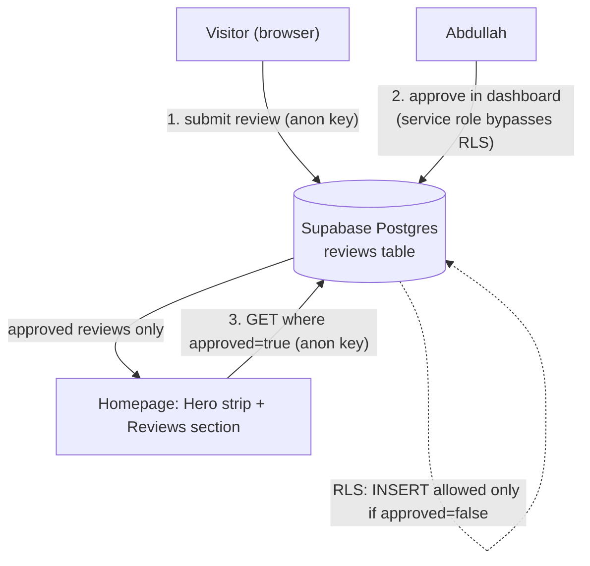

# Feature Plan — Reviews & Testimonials

**Status:** Implemented (code complete) · awaiting Supabase setup + E2E verification · **Owner:** Abdullah Sherdy · **Created:** 2026-08-20
**Skills applied:** `architecture-designer` (requirements + ADR + trade-offs), `react-expert` (data fetching + accessible components), `frontend-design` (section design + copy)

---

## 1. Context

The portfolio's two goals are **get hired** (engineering) and **sell teaching services** (courses, group courses, mentorship). Right now nothing on the site independently vouches for the quality of that work — a visitor has only Abdullah's own words. Social proof from real students, parents, and clients is the single highest-leverage trust signal for both goals.

**The requirement, precisely stated:** *visitors submit reviews themselves* ("I don't want to fill them manually"), and approved reviews then appear across the site — in a dedicated homepage **section**, a **navbar** link, and a **hero** social-proof strip.

**The hard constraint:** the site is a **static SPA on Vercel with no backend** ([`vercel.json`](../../vercel.json) is a pure catch-all rewrite; there are no serverless functions). A static frontend cannot store what visitors submit, and **arbitrary internet input must never publish directly onto a professional homepage** — that is a spam/abuse/reputation hazard. So the true flow is:

> **visitor submits → review is stored as _pending_ → Abdullah approves → it auto-publishes live.**

This satisfies "don't fill them manually" (visitors write the content) while keeping an approval gate (nothing public without a click). Approval happens in a dashboard — **no code edit or redeploy per review.**

**Intended outcome:** a low-maintenance, spam-resistant, on-brand testimonials system that makes quality visible to both hiring managers and prospective students.

---

## 2. Requirements

### Functional
- **FR1** — A visitor can submit a review: name, role/relationship, category (engineering/client vs teaching), 1–5 star rating, quote, optional org/course.
- **FR2** — Submissions persist durably in a datastore.
- **FR3** — New submissions default to **unapproved** and are invisible to the public until approved.
- **FR4** — Abdullah approves/rejects from a dashboard (no app code change, no redeploy).
- **FR5** — Approved reviews render in a homepage **Reviews section** as a card wall with star ratings, teal for engineering/client and amber for teaching.
- **FR6** — A **navbar** "Reviews" link scrolls to the section and participates in scrollspy highlighting.
- **FR7** — The **Hero** shows an aggregate social-proof strip (avg rating + count) that links to the section, and hides gracefully when there are zero reviews.

### Non-functional
- **NFR1 — Cost:** free tier only (personal site).
- **NFR2 — Ops:** minimal; solo maintainer; no server to run.
- **NFR3 — Abuse resistance:** moderation gate + honeypot + validation + RLS; no unapproved content is ever served.
- **NFR4 — Privacy:** collects real people's names/roles → explicit submit-time consent notice; store no more PII than needed (no email required for public display).
- **NFR5 — Consistency:** reuse existing conventions (section shell, `SectionHeading`, `AnimatedSection`, teal/amber card discriminator, `useToast`, `MagneticButton`, env-var access, `src/lib/` modules).
- **NFR6 — Resilience:** if the datastore env vars are absent, degrade silently (mirror the EmailJS "no-op without env" behavior) — the site must still build and render.

---

## 3. Architecture

### Decision (ADR-001): Use Supabase (managed Postgres + Row-Level Security)

**Status:** Accepted (user-selected) · **partially superseded by [Addendum A](#addendum-a--moderation-gate-removed-2026-08-21)** — the moderation gate was removed 2026-08-21; the Supabase/RLS foundation below still stands.

**Context:** A static SPA needs a write target for submissions and a read path for approved reviews, plus a moderation step — with near-zero ops and cost.

**Decision:** Use **Supabase**. The browser talks directly to Supabase via `@supabase/supabase-js` with the public **anon key**. **Row-Level Security** enforces the entire security model:
- `anon` may **INSERT** rows only when `approved = false` (can't self-approve).
- `anon` may **SELECT** only rows where `approved = true`.
- No `anon` UPDATE/DELETE (denied by default).

Moderation uses the **Supabase dashboard** (service role bypasses RLS, so pending rows are visible there) — **no admin UI to build, no auth to write.**

**Alternatives considered:**
- *Vercel Functions + DB* — full control, one vendor, but requires writing/maintaining submit/list endpoints **and** an authenticated approve path. More code, more upkeep.
- *Own .NET API* — showcases backend skills, but heaviest to build/host/operate for a testimonials widget; over-engineered for the scale (NFR2).
- *Form service + manual publish* — simplest infra, but requires a code edit + redeploy per review, only partially meeting "don't fill them manually."

**Consequences:**
- (+) Real Postgres (fits the stack), free tier, fastest to ship, security lives in declarative RLS, moderation is a dashboard toggle, approval publishes live with no redeploy.
- (−) One new external service and a documented outbound data flow (submissions + reads leave the browser to Supabase) — inventory it per the "no silent external data routing" rule, alongside the existing EmailJS and godbolt flows.

### Data flow



Runtime fetch (not build-time bake) is deliberate: approving in the dashboard makes a review appear **live without a redeploy**, which is the point of FR4. (Build-time baking is noted as an optional SEO enhancement in §9.)

---

## 4. Data model

### Table + RLS (run once in Supabase SQL editor)

> ⚠️ **Superseded by [Addendum A](#addendum-a--moderation-gate-removed-2026-08-21) (2026-08-21).** The `create table` below is still correct for a fresh setup, but the INSERT policy `with check (approved = false)` and the column default `false` have been reversed to auto-publish. Run the table/policies below **first**, then apply Addendum A's migration SQL.

```sql
create table public.reviews (
  id         uuid primary key default gen_random_uuid(),
  created_at timestamptz not null default now(),
  name       text not null check (char_length(name) between 2 and 80),
  role       text not null check (char_length(role) between 2 and 60),
  org        text          check (org is null or char_length(org) <= 80),
  category   text not null check (category in ('engineering','teaching')),
  rating     int  not null check (rating between 1 and 5),
  quote      text not null check (char_length(quote) between 10 and 600),
  approved   boolean not null default false
);

alter table public.reviews enable row level security;

create policy "anon can submit reviews"
  on public.reviews for insert to anon
  with check (approved = false);

create policy "anon can read approved reviews"
  on public.reviews for select to anon
  using (approved = true);

create index reviews_approved_created_idx
  on public.reviews (approved, created_at desc);
```

DB `check` constraints intentionally mirror the client validation (defense in depth). Moderation query when not using the table UI: `update public.reviews set approved = true where id = '…';`.

### TypeScript types (`src/lib/reviews.ts`)

Mirrors the `interface + typed data` convention from [portfolio.ts](../../src/data/portfolio.ts) and reuses the exact `"engineering" | "teaching"` union already at [portfolio.ts:112](../../src/data/portfolio.ts#L112).

```ts
export interface Review {
  id: string;
  name: string;
  role: string;                              // "Student" · "Parent" · "Client" · "Colleague" · free text
  org: string | null;                        // optional course/company
  category: "engineering" | "teaching";      // drives teal vs amber, reusing the site-wide discriminator
  rating: number;                            // 1–5
  quote: string;
  createdAt: string;
}

export type ReviewInput = Omit<Review, "id" | "createdAt">;
```

---

## 5. Security & spam

| Control | Mechanism |
|---|---|
| **No unapproved content served** | RLS `SELECT USING (approved = true)` — the datastore itself refuses to return pending rows to `anon`. |
| **No self-approval** | RLS `INSERT WITH CHECK (approved = false)`. |
| **Bot filter** | Hidden honeypot field (e.g. `website`); if filled, the client silently drops the submit (no insert). |
| **Input validation** | Client `validate()` (lengths, rating 1–5, required fields) **and** matching DB `check` constraints. |
| **XSS** | Reviews render as plain text via React (auto-escaped). **Never** `dangerouslySetInnerHTML` for review content. |
| **Privacy / consent** | Submit-time notice: "By submitting, you agree your first name, role, and review may be shown publicly on this site." No email stored for public display. |
| **Key exposure** | The anon key is designed to be public; RLS is the boundary. Do **not** ship the service role key to the client. |
| **Rate limiting** | Not on the free tier per-IP; moderation is the real publish gate. Optional hardening (future): a client cooldown in `localStorage`, or Cloudflare Turnstile on the form. |

---

## 6. Frontend design direction

Grounded in the existing identity: a **.NET backend engineer + instructor** with a terminal/mono motif (`$ whoami`), teal = engineering, amber = teaching (see [docs/design-system.md](../../docs/design-system.md)).

**Avoid the template.** The generic testimonials answer is a flat 3-column grid of gold-star cards with giant quotation marks. We keep the scannable wall (it genuinely serves the goal) but give it a **signature** tied to Abdullah's world:

- **Signature — "verified" review cards with a category tag.** Each card carries a small mono `.eyebrow`-style tag naming the relationship (`student` / `parent` / `client` / `colleague`) and a subtle `✓ verified` marker (these were approved by a human — lean into that). The teal/amber split is carried by a **left accent bar** + icon tint rather than a full card wash, so the wall reads calmer than a candy-colored grid.
- **Aggregate proof as a terminal line.** The section eyebrow/summary echoes the Hero's `$ whoami`: e.g. `$ reviews --summary → 4.9★ · 32 verified`. This is the one memorable, on-brand flourish; everything else stays quiet.
- **Card content:** star row (rating) · quote · name · role/relationship · org (if any).
- **Categorization on the wall:** teal cards = client/engineering; amber cards = teaching — reusing `teachingCardClass` / `engineeringCardClass` from [Services.tsx](../../src/components/sections/Services.tsx) (`border-accent/*` vs `border-primary/*`, `text-accent` vs `text-primary`).
- **"Write a review" CTA** opens a modal (shadcn `Dialog`) so the wall stays uncluttered.
- **Hero strip:** a compact `.eyebrow` + stars + "N reviews" row inserted as a new `AnimatedSection` (`delay={700}`) between the CTA block and the Core Technologies strip in [Hero.tsx](../../src/components/sections/Hero.tsx); it links to `#reviews` and renders **only when count > 0**.

**States & copy (active voice, sentence case):**
- Empty: *"Be the first to share your experience."* + the CTA.
- Loading: card skeletons (avoid layout shift).
- Submit success (toast): *"Thanks — your review is in. It'll appear here once I approve it."*
- Submit error (toast, `variant: "destructive"`): *"Couldn't submit your review. Please try again."*
- Not configured (no env): section hides its form/wall gracefully — site still renders.

---

## 7. Files to create / modify

### New
| File | Purpose |
|---|---|
| `src/lib/supabase.ts` | Supabase client singleton; returns `null` if env vars absent (mirrors EmailJS no-op). |
| `src/lib/reviews.ts` | `Review`/`ReviewInput` types, `fetchApprovedReviews()`, `submitReview()`, `computeReviewStats()` (avg + count). Mirrors [`src/lib/articles.ts`](../../src/lib/articles.ts) as the data-module precedent. |
| `src/components/reviews/StarRating.tsx` | Accessible star widget — **input** variant (radiogroup, keyboard arrows, built from `lucide` `Star`) and read-only **display** variant (`aria-label="4 out of 5 stars"`). No primitive exists; this is the one thing built from scratch. |
| `src/components/reviews/ReviewCard.tsx` | Single testimonial card; teal/amber by `category`. |
| `src/components/reviews/ReviewForm.tsx` | Submission form inside a `Dialog`. Mirrors [Contact.tsx](../../src/components/sections/Contact.tsx): controlled `useState`, `validate()`, `useToast`, `MagneticButton type="submit"`, honeypot field. Submit via TanStack `useMutation`. |
| `src/components/sections/Reviews.tsx` | The section: `SectionHeading` + terminal-style aggregate line + "Write a review" dialog trigger + card-wall grid. Fetches with `useQuery({ queryKey: ["reviews"] })`. |

### Modified
| File | Change |
|---|---|
| [src/pages/Index.tsx](../../src/pages/Index.tsx) | Import + render `<Reviews />` **between `<About />` (L76) and `<Contact />` (L77)**; add `"reviews"` to the `sectionIds` array (L28). |
| [src/components/sections/Navbar.tsx](../../src/components/sections/Navbar.tsx) | Add one `navLinks` entry `{ href: "/#reviews", id: "reviews", label: "Reviews" }` (both desktop + mobile render from this one array). |
| [src/components/sections/Hero.tsx](../../src/components/sections/Hero.tsx) | Insert the social-proof `AnimatedSection` (`delay={700}`) between CTAs and Core Technologies; consume shared `useQuery(["reviews"])` cache. |
| [.env.example](../../.env.example) | Add `VITE_SUPABASE_URL=` and `VITE_SUPABASE_ANON_KEY=`. |
| `package.json` | Add dependency `@supabase/supabase-js`. |
| [docs/design-system.md](../../docs/design-system.md) | Document the review-card variant + `StarRating` (keep the design system current). |

**Data fetching:** activate the already-mounted-but-unused `QueryClientProvider` ([App.tsx:18](../../src/App.tsx#L18)). Hero and Reviews share `queryKey: ["reviews"]`, so TanStack Query dedupes to a single request and caches it. `enabled: !!supabase` so it no-ops when unconfigured. On successful submit, `invalidateQueries(["reviews"])` (the new pending row correctly won't appear until approved).

---

## 8. Implementation phases

1. **Supabase setup (manual, ~15 min):** create project → run the §4 SQL → copy Project URL + anon key into `.env` (and document in `.env.example`).
2. **Data layer:** `src/lib/supabase.ts` + `src/lib/reviews.ts` (types, fetch, submit, stats). `tsc --noEmit` clean.
3. **Primitives:** `StarRating.tsx` (input + display, keyboard-accessible) → `ReviewCard.tsx`.
4. **Form:** `ReviewForm.tsx` in a `Dialog`, mirroring Contact's validate/toast pattern + honeypot + `useMutation`.
5. **Section:** `Reviews.tsx` (fetch, loading skeleton, empty state, wall, aggregate terminal line, CTA).
6. **Wire-up:** Index.tsx (render + scrollspy), Navbar.tsx (nav link), Hero.tsx (proof strip).
7. **Docs:** update `docs/design-system.md`; inventory the Supabase data flow.
8. **Verify (§9) → commit → push** (per "Landing the Plane").

---

## 9. Verification

**End-to-end (primary gate — repo has no test runner per [CLAUDE.md](../../CLAUDE.md)):**
1. `npm run dev`. With env unset first: confirm the site builds/renders and the Reviews section degrades gracefully (no crash).
2. Set env → submit a review → assert success toast and that it does **not** appear yet (still pending).
3. In Supabase: confirm the row exists with `approved = false`; flip to `true`.
4. Reload homepage → the review now appears in the wall; Hero strip shows updated count/avg; navbar "Reviews" link scrolls + highlights.
5. Empty state: with no approved rows, section shows "Be the first…"; Hero strip is hidden.
6. Abuse checks: fill the honeypot via devtools → submit is dropped; try `rating = 0` / oversized quote → blocked by client and DB.
7. A11y: tab to stars, set rating with arrow keys; verify focus rings and `aria-label`s; check reduced-motion.
8. `npm run build` succeeds (prerender is non-fatal); `npm run lint` clean.

**Optional unit tests** (only if adding Vitest): pure functions `computeReviewStats()` and the `validate()` logic — no network.

---

## 10. Risks & future enhancements

- **SEO of testimonials:** client-rendered reviews aren't in the prerendered HTML snapshot. *Enhancement:* fetch approved reviews at build time in a script (like [generate-sitemap.mjs](../../scripts/generate-sitemap.mjs)) to bake a JSON file + emit JSON-LD `AggregateRating`/`Review` for rich snippets — strong for the "get hired" goal. Deferred to keep v1 simple.
- **Spam volume:** if honeypot proves insufficient, add Cloudflare Turnstile to the form (still moderated regardless).
- **Doc drift:** [CLAUDE.md](../../CLAUDE.md) references `artifacts/design-system.md`, but the file lives at [docs/design-system.md](../../docs/design-system.md). Worth fixing the reference while touching docs.
- **Editing/deletion:** removing or editing a published review is a dashboard action (no app UI) — acceptable for v1.

---

## Addendum A — Moderation gate removed (2026-08-21)

**Status:** Accepted (user-selected) · supersedes the pending-approval behavior in ADR-001, §4 SQL, §5, and §6 copy.

**Decision:** Reviews now **publish immediately on submit** — no manual approval step. The `approved` column and the read-side filter are kept, but the *default* flips to `true` and the INSERT policy is relaxed so anon-submitted rows are visible at once.

**Migration SQL (run once in the Supabase SQL editor):**

```sql
-- 1. New reviews are visible immediately (was: false).
alter table public.reviews alter column approved set default true;

-- 2. Let anon insert those now-approved rows (old policy required approved = false).
alter policy "anon can submit reviews" on public.reviews
  with check (approved = true);

-- 3. (Optional) publish any rows still pending from the moderated era.
update public.reviews set approved = true where approved = false;
```

**What is retained:** the `approved` column stays as a **kill switch** — set a row to `approved = false` in the dashboard to hide a bad/spam review after the fact (RLS SELECT still filters `approved = true`, and `fetchApprovedReviews()` is unchanged). No `anon` UPDATE/DELETE, so a visitor still can't alter or unhide rows.

**Accepted risk:** this reverses NFR3's "no unapproved content is ever served." Arbitrary internet input now reaches the public homepage directly, filtered only by the honeypot, client `validate()`, and DB `check` constraints. Reputation/spam exposure is the tradeoff for zero-touch publishing. **Mitigation / upgrade path:** if spam appears, add Cloudflare Turnstile to the form (§10) and/or re-tighten the INSERT policy to `with check (approved = false)` + default `false` to restore the gate — the code path supports both without changes.
